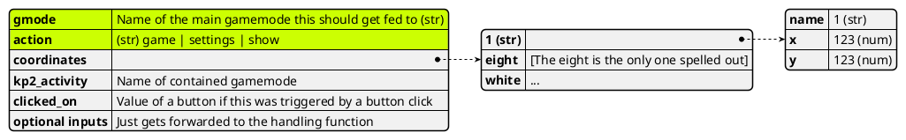
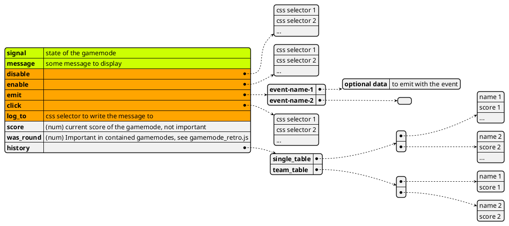

Frontend and data exchange processes
====================================

As this documentation is built using Sphinx, which automatically only documents Python programs, the backend-frontend interaction needs to be manually documented.

..
    Make references with:
    :ref:`Text of reference bla bla <Precision>`

This module implements a Model-View-Controller architecture for playing different gamemodes. 

A gamemode is the model, consisting of different steps (states). It defines the process through its TREE attribute (see :ref:`GameMode documentation <GameMode>`). For every step/state, this dictionary defines 
- the function/method to call on submission, 
- the next state depending on the functions output,
- the image to send to the beamer and
- (often unused) the interface to get rendered on the frontend.
A gamemode in this implementation can contain other gamemodes (see :ref:`KP2<KP2>`), which should be treated in a way similar to the implementation in :ref:`KP2<KP2>`.

The controller is implemented in the main :ref:`Game class<Game>` (`_gamemode_controller.py`) and is accessible via POST requests at `/gamemodecontroller`. This is the main endpoint for interactions between the model and the view (client). It
#. receives the JSON data from the client, 
#. passes it to the appropriate gamemode, 
#. organizes the actions that should be taken from the return (new images, play sound), and 
#. returns a serialized JSON object to the client.

##############################
Frontend scripts and functions
##############################

The view of the MVC is defined by the frontend loaded clientside. This includes the gamemode website (`/gamemode/[name]`) as well as a number of common JavaScript resources. In the following listing `.class` and `#id` represent CSS selectors.

From `base.html` (on which all gamemodes extend) the following resources are loaded:

- `gamemode_controller.js`: Implements methods for communicating with the server.
    #. `sender(apiEndpoint, jsonData)`: POST the json data to the endpoint. Does not return.
    #. `getCoordsAndConfirm(event, jsonData, fun=controller, final=...)`: This is called from some `click`/ `change` event listeners (mostly see `gamemode_retro.js`). If the `manipulatedFlag` is not raised, it requests new coordinates to be loaded from the Camera Module using `getCameraCoordinatesAsync`. This loads and displays the new coordinates. On a second invocation (tracked by setting `step_coordinate_process` property on the event target) or if `manipulatedFlag` is raised, it now passes the passed `jsonData` to the `fun` (a :ref:`controller function<JS.controller>`). It runs the passed `final` function on the promise result (`.then` call) and returns that result as a resolved promise. 

- `coords-handler.js`: This is the main script for interacting with the livestream and manipulate coordinates.
    #. Adds a `click` event listener to `#reload-livestream` to reload the livestream (`#livestream` img) by cache busting.
    #. `getCameraCoordinatesAsync`: if `manipulatedFlag` is not set, call `/camera/coords` and place the returned coords using `placeAllBalls(coords)`.
    #. `placeAllBalls(coords)`: based on coordinates in the backend format (name e.g `1` instead of `ball-1`), highlights the ball selectors (in `#ball-selector`) by adding `.ball-exists` class to all mentioned balls, removing it from all buttons previously. Also resets the `coordinates` JSON object and hides all placed ball images. Then places every mentioned ball using `placePointFromRealDim`, passing the coordinates and the id of the ball image to be displayed.
    #. `placePointFromRealDim(xr, yr, id)`: rescales `x` and `y` coordinates to match the livestream size in pixels based on the size of the table. Calls `placePoint` to actually display the ball image.
    #. `placePoint(x, y, id, realBall=true)`: places a ball image (based on the passed id) on the livestream. If it is a `realBall`, the coordinates get added to `coordinates`, otherwise to `altCoordinates` (for non-ball objects, not really used at the moment).
    #. `pxToReal(x)`: utility function to translate pixels to real length on the billard table.
    #. Adds a `click` event listener to `.ball` to remove it from the `coordinates` JSON object, the livestream image and remove `.ball-exists` from its selector input (e.g. `#ball-selector input[value=ball-1]`). This raises the `manipulatedFlag`.
    #. Adds a `click` event listener to the `#livestream` to place to `current_ball` on the livestream image. This raises the `manipulatedFlag`.
    #. `sendCorrectedCoords`: POSTs the current coordinates in the backend format (e.g. `"1"` instead of `"ball-1"`) to `/general/correctedcoords` using `coordinatesBackend` and `sender` function.
    #. Adds a `click` event listener to `#manipulation-flag` checkbox to set `manipulatedFlag` according to its checked status. This can be used to lower the flag.
    #. Adds `click` event listeners to every radio input in `#ball-selector`, setting the `current_ball` according to the selected radio.
    #. `coordinatesBackend`: Returns `coordinates` transformed to the backend compatible format.
    #. Adds debugging `click` event listeners to `#toggle-inference` (GET `camera_address + /v1/togglequick`) and `#stop-livestream` (GET `camera_address + /v1/stopgeneration`).

- `history_handler.js`: Provides `update_scoreboard` function, which builds a new HTML tables from past history data (see :ref:`GameMode history method<GameMode>`) and puts it into `#table-team` and `#table-single`. Also adds an event listener for `update_scoreboard`, passing the event `e.details` JSON to the `update_scoreboard` function.
- `update_gamemode.js`: Adds a `click` event listener to every `.collapsible` to open that object and close all others, setting `current_gamemode` to the `button.parentElement.id`. If the button is already expanded when clicked on, it collapses and `current_gamemode="base"`.
- `gamemode_retro.js`: The main builder of event listeners to every gamemode on the page (`.mode`). For every mode, add:
    #. `change` event listener to `.setting` to send the inputs contained in the setting container to the server using `send_setting`
    #. For every `.step` (a single state of the gamemode) add a `click` (button) or `change` (checkbox) event listener to the `input.submit-step` matches. This event calls a :ref:`controller function<JS.controller>`, sending a CtS-JSON message to the server and executing the returned StC-JSON message.
    #. This file also provides functions:
        - `getAllInputValues(container)`: returns a JSON of all input name - value pairs found inside the container
        - `activate_step(gamemode, new_step)`: adds class `deactivated` to all other steps of the gamemode.
        - `send_setting(setting_container, print=false, meta=false)`: gets all inputs from the container (`getAllInputValues`), adds basic CtS-JSON properties and sends to server using a :ref:`controller function<JS.controller>`. If `meta=true`, it does not add a `kp2_activity="settings"` property.

- `game_configuration.js`: adds `focusout` event listener to every `.global-config` element to send all contained values (`getAllInputValues`) to the server using send_setting

.. _JS.controller:

####################
Controller Functions
####################

A controller function is the main interaction function between the client and the server. It adds organisational fields to the passed json data, sends it to the server (`/gamemodecontroller`), and takes actions based on the return, finally returning the json answer.

Each gamemodes website defines the controller function to use by loading it. The function gets set as the global `controller` variable to be included in other functions.

- `vanillaController` (`vanillaController.js`): This is used by all gamemodes which are "monolithic", meaning not containing other gamemodes. It adds the field `gmode` set as `global_gamemode` to the passed json data. Actions can be taken on the following fields set in the returns:
    #. `notification` (`str`): shows a temporary (6s) alert in the upper left corner by calling `tempAlert` (defined in `base.html`).
    #. `disable` (`list`): adds the `deactivated` class to all elements matching the CSS selectors passed in the list.
    #. `enable` (`list`): like `disable`, but removing the `deactivated` class.
    #. `emit` (`json`): emits events onto the `window`, defined as `{"[event-name]: {[optional data]}, ... }`.
    #. `click` (`list`): emits a `click` event onto every element matching the CSS selectors in the list.
    #. `log_to` (`str`): writes the `message` field value of the response to the first element that matches the CSS selector of this field. This removes the `message` field.

- `kp2Controller(jsonData, set_activity=true)` (`kp2Controller.js`): This is used by all gamemodes that contain other gamemodes. If implemented with an `entrance` function "routing" like :ref:`KP2<KP2>`, setting the field `kp2_activity` will pipe the data to the contained gamemode model. 
    - This controller sets the fields
        #. `gmode` as `global_gamemode` (currently either `kp2` or `final_competition`)
        #. `kp2_activity` as `current_gamemode`, but only if `set_activity` is `true`.
    - This controller responds to the fields:
        #. `notification` (`str`): shows a temporary (6s) alert in the upper left corner by calling `tempAlert` (defined in `base.html`).
        #. `disable` (`list`): adds the `deactivated` class to all elements matching the CSS selectors passed in the list.
        #. `enable` (`list`): like `disable`, but removing the `deactivated` class.
    - Additionally, it adds a `gamemode_updated` event to the `document`, triggering `kp2Controller({"action": "show"})` which leads to the Game Module to send the newly opened gamemode's image to the Beamer Module.

#########################
StC and CtS JSON messages
#########################

This part describes the reference for Server-to-Client and Client-to-Server JSON messages.

Mandatory fields are highlighted in green, common fields with already implemented handlers are orange.

    
    This is an examplary message from the client to the server.

    This is an examplary message from the server to the client.