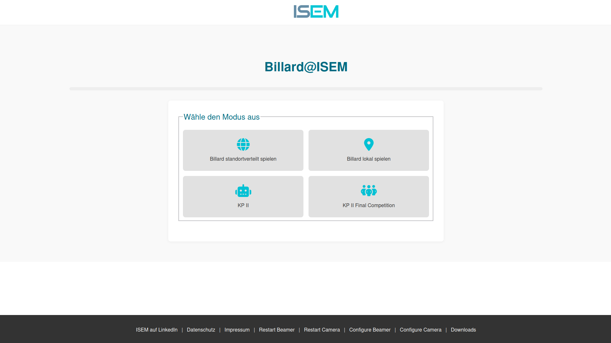
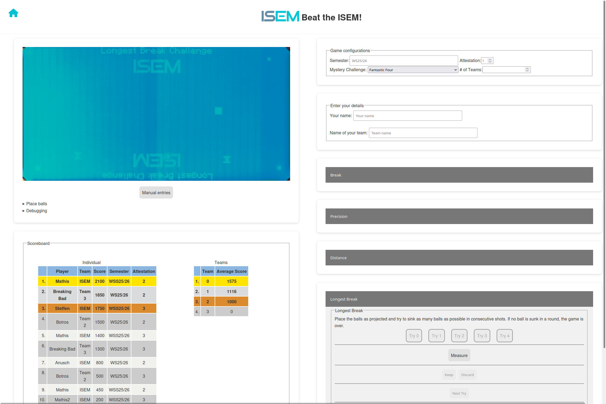
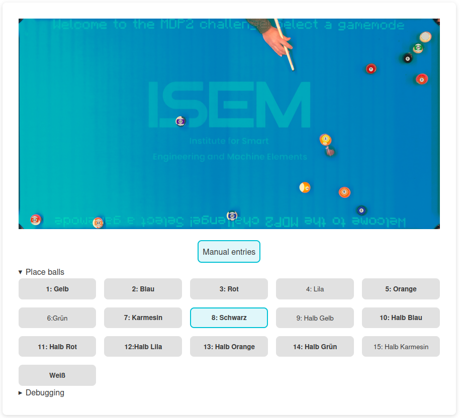

User manual
===========

As this system is mainly used in course contexts, users include students and lecturers. This manual is only concerned with interactions with websites of the Game Module. Other modules should usually not be visited by users, as debugging features are included on this page.

Index page
##########

.. _UM.index:

    The index page with four selectable games and a list of links in the footer.

After opening the website, the user is prompted with a selection of gamemodes. Usually, the user can directly select the wanted gamemode. For debugging purposes, the other modules (Camera and Beamer) are accessible in the footer, where they can be restarted or have their website opened. This will open in a new tab, when restarting the tab will not load (obviously, this indicates a successfull restart).

Game page
#########

Opening or reloading a game site always resets the game progress. Be aware of that feature, especially in longer challenges like the KP2. Debugging like reloading the camera can be done without reloading the website!

    An examplary games website (KP2) with the livestream (upper left), leaderboards (bottom left), options (upper right) and sub-gamemodes context menus (bottom right). The mode "Longest Break" is selected. The context menus "Place balls" and "Debugging" below the livestream are not open and the "Manual entries" option is not active.

The website of a game always follows the same structure. On the left half, the livestream with companioning menus, and the leaderboards are displayed. On the right, gamemode specific menus are shown. In this case, the KP2 mode has options and games (challenges), which are partially collapsed. By clicking on the challenge names, :ref:`their menu<UM.challenges>` opens.

Configurations can be made by entering data into the fields. All fields are mandatory, clicking onto anything else on the page applies the configuration. In the KP2 mode, this can be seen by the leaderboards only displaying results from the same semester as entered in the semester field.

The index page can be opened by clicking on the house icon in the upper left.

.. _UM.challenges:

Challenge menu
**************

.. figure:: images/distance_challenge.png

    The distance challenge context menu. A description of the challenge is given with instructions for entering data. As the user has five tries for the distance challenge in the KP2, there are five boxes where results will be entered into.

A challenge's menu contains all relevant steps to complete the challenge. The active step is enabled, with all others being greyed-out. By opening the challenge menu, the beamer displays the challenge on the billard table. 

In this examplary menu, the number of collisions must also be entered. This is needed as the system can't reliably track collisions with borders, especially at high speeds.

Clicking on a button (unless its a button for a decision, like "Next Try") loads the coordinates of all balls on the table and displays them on the livestream window and on the table. As this system uses an artificial intelligence model, it can make errors. If the user sees errors, they can correct them like shown :ref:`below<UM.correction>`. Click on the button again to finally use the ball positions for the challenge the evaluate. This can not be reversed, so make sure that there are no mistakes in the ball positions.

Final submission and reset
**************************

In special gamemodes like KP2, containing challenges, the results need to be manually submitted using the "submit" button at the bottom. This is also possible when not all challenges have been done. In the case of KP2, a new entry appears in the scoreboard (highlighted in red) and a summary is shown just below the "submit" button.

Gamemodes can be reset after they are finished, but the safest way is  to just reload the page.

.. _UM.correction:

Correcting wrong positions
**************************

    The livestream with an expanded "Place balls" menu. Balls that are detected or placed can be seen on the livestream window and their names are **bold** in the menu. "Manual entries" are activated.

If there are mistakes in the ball position, they can be corrected by opening the "Place balls" menu. For a quick glance, all balls that are currently detected are marked with **bold** text. By clicking onto the names of the balls, they are selected. Now clicking on the livestream will place the ball at the click position. Click on a detected ball to delete it.
Changes are mirrored onto the beamer module.

Manipulating the detected coordinates activates "Manual entries" (blue if active). As long as this is active, the website will not load new coordinates from the camera but always use the positions that are currently displayed. 

It is **very important** to deactivate the "Manual entries" when the balls are moved and next step should be measured.

Accessing collected data
************************

In the footer of the :ref:`index page<UM.index>` a link to the downloads page is provided (`/download`). This page is login protected, where the password was set during the setup process. On that page, the histories of all gamemodes can be downloaded. Some gamemodes like KP2 are also provided as Excel files.

For every challenge, the finishing time and results are saved. Additional information on the configuration, scoring and played games are included. It does not save personal information besides player name (which has only ever been used for "cool" team names), team name (mostly just a number) and temporal information.